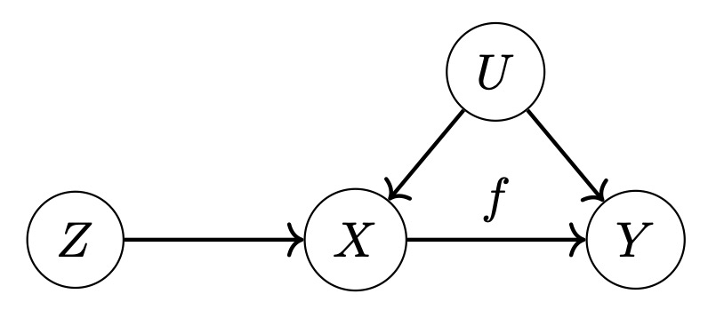

# Estimation with Conditional Moment Restrictions
This repository contains a number of state-of-the-art estimation tools for (conditional) moment restriction problems of the form
```math
        E[\psi(X,Y;\theta)|Z] = 0 \ \  P_Z\text{-a.s.}
```
    
where e.g. for instrumental variable (IV) regression the moment function becomes $\psi(X,Y;\theta) = Y - f_\theta(X)$ and $Z$ denotes the instruments.
In IV regression one is interested in inferring the functional relation $f$ between random variables $X$ and $Y$ which is obfuscated by a non-observed confounder $U$. The scenario is visualized as a causal diagram below.
<p align="center">

</p>

Parts of the implementation are based on the codebase for the [Variational Method of Moments](https://github.com/CausalML/VMM) estimator.

## Installation
To install the package, create a virtual environment and run the setup file from within the folder containing this README, e.g. using the following commands:
```bash
python3 -m venv cmr_venv
source cmr_venv/bin/activate
pip install -e .
```

## Usage
### High level usage with hyperparameter search
The simplest way to train any moment restriction estimator is via the ```estimation``` function from the module [cmr/estimation.py](https://github.com/HeinerKremer/conditional-moment-restrictions/blob/main/cmr/estimation.py).
This automatically involves a hyperparameter search and if applicable early stopping.
The ```estimation``` uses the following syntax:
```python
from cmr import estimation
trained_model, stats = estimation(model=model,  
                                  train_data=train_data,
                                  moment_function=moment_function,
                                  estimation_method='KMM-neural',
                                  **kwargs)
```

The relevant arguments are detailed below.

| Argument                | Type | Description                                                   |
|-----------------------|-------------|--------------------------------------------------------|
| ```model``` | torch.nn.Module | Torch model containing the parameters of interest |
| ```train_data``` | dict, {'t': t, 'y': y, 'z': z} | Training data with treatments ```'t'```, responses ```'y'``` and instruments ```'z'```. For unconditional moment restrictions specify ```'z'=None```. |
| ```moment_function``` | func(model_pred, y) -> torch.Tensor | Moment function $\psi$, taking as input ```model(t)``` and the responses ```y``` |
| ```estimation_method``` | str | See below for implemented estimation methods |
| ```estimator_kwargs``` | dict | Specify estimator parameters. Default setting is contained in [cmr/default_config.py](https://github.com/HeinerKremer/conditional-moment-restrictions/blob/main/cmr/default_config.py)|
| ```hyperparams``` | dict | Specify estimator hyperparameters search space as ```{key: [val1, ...,]}```. Default setting is contained in [cmr/default_config.py](https://github.com/HeinerKremer/conditional-moment-restrictions/blob/main/cmr/default_config.py) |
| ```validation_data``` | dict, {'t': t, 'y': y, 'z': z} | Validation data. If ```None```, ```train_data``` is used for hyperparam tuning.|
| ```val_loss_func``` | func(model, val_data) -> float | Custom validation loss function. If `None` uses l2 norm of moment function for unconditional MR and HSIC for conditional MR.|
| ```normalize_moment_function``` | bool | Pretrains parameters and normalizes every output component of `moment_function` to variance 1. |
| ```verbose``` | bool | If `True` prints out optimization information. If `2` prints out even more. |

### Implemented estimators
| `estimation_method`               | Description                                                   |
|-----------------------|-----------------------------------------------------------|
| Unconditional moment restrictions  | |
| `'OLS'`| Ordinary least squares |
| `'GMM'`| Generalized method of moments |
| `'GEL'`| Generalized empirical likelihood |
| `'KMM'`| [Kernel Method of Moments](https://arxiv.org/abs/2305.10898) |
| Conditional moment restrictions | |
| `'SMD'`| [Sieve minimum distance](https://onlinelibrary.wiley.com/doi/epdf/10.1111/1468-0262.00470) |
| `'MMR'`| [Maximum moment restrictions](https://arxiv.org/abs/2010.07684) |
| `'VMM-kernel'`| [Variational method of moments](https://arxiv.org/abs/2012.09422) with RKHS instrument function |
| `'VMM-neural'`| [Variational method of moments](https://arxiv.org/abs/2012.09422) with neural net instrument function (i.e., [DeepGMM](https://arxiv.org/abs/1905.12495))|
| `'FGEL-kernel'`| [Functional generalized empirical likelihood](https://proceedings.mlr.press/v162/kremer22a.html) with RKHS instrument function |
| `'FGEL-neural'`| [Functional generalized empirical likelihood](https://proceedings.mlr.press/v162/kremer22a.html) with neural net instrument function |
| `'KMM-neural'`| [Kernel Method of Moments](https://arxiv.org/abs/2305.10898) with neural net instrument function and RF approximation |


### Code example
All estimators can be trained following the below syntax. The code can be run in the notebook [example.ipynb](https://github.com/HeinerKremer/conditional-moment-restrictions/blob/main/example.ipynb).

```python
import torch
import numpy as np
from cmr.estimation import estimation

# Generate some data
def generate_data(n_sample):
    e = np.random.normal(loc=0, scale=1.0, size=[n_sample, 1])
    gamma = np.random.normal(loc=0, scale=0.1, size=[n_sample, 1])
    delta = np.random.normal(loc=0, scale=0.1, size=[n_sample, 1])

    z = np.random.uniform(low=-3, high=3, size=[n_sample, 1])
    t = np.reshape(z[:, 0], [-1, 1]) + e + gamma
    y = np.abs(t) + e + delta
    return {'t': t, 'y': y, 'z': z}

train_data = generate_data(n_sample=100)
validation_data = generate_data(n_sample=100)
test_data = generate_data(n_sample=10000)

# Define a PyTorch model $f$ and a moment function $\psi$
model = torch.nn.Sequential(
            torch.nn.Linear(1, 20),
            torch.nn.LeakyReLU(),
            torch.nn.Linear(20, 3),
            torch.nn.LeakyReLU(),
            torch.nn.Linear(3, 1)
        )

# Instrumental variable regression
def moment_function(model_evaluation, y):
    return model_evaluation - y

# Train the model
trained_model, stats = estimation(model=model,  
                                  train_data=train_data,
                                  moment_function=moment_function,
                                  estimation_method='KMM-neural')
# Make prediction
y_pred = trained_model(torch.Tensor(test_data['t']))
```

### Low level usage
Instead of relying on the ```estimation``` function every estimator can be trained with fixed hyperparameters ```kwargs``` with the following syntax:
```python
from cmr.methods.kmm_neural import KMMNeural

estimator = KMMNeural(model=model, 
                      moment_function=moment_function, 
                      **kwargs)
estimator.train(train_data, validation_data)
trained_model = estimator.model
```
The optional keyword arguments ```kwargs``` are specific for each estimator and can be found in [cmr/default_config.py](https://github.com/HeinerKremer/conditional-moment-restrictions/blob/main/cmr/default_config.py).

## Experiments and reproducibility
To efficiently run experiments with parallel processing refer to [run_experiments.py](https://github.com/HeinerKremer/conditional-moment-restrictions/blob/main/run_experiment.py).
As an example you can run:
```python
python run_experiment.py --experiment heteroskedastic --n_train 256 --method KMM-neural --rollouts 10
```


[comment]: <> (## Reproducibility)

[comment]: <> (The experimental results presented in the [paper]&#40;https://proceedings.mlr.press/v162/kremer22a.html&#41; can be reproduced by running the script [run_experiment.py]&#40;run_experiment.py&#41; via)

[comment]: <> (```)

[comment]: <> (python3 run_experiment.py --experiment exp --run_all --method method --rollouts 50)

[comment]: <> (```)

[comment]: <> (with `exp in ['heteroskedastic', 'network_iv']` and `methods in []`.)

## Citation
If you use parts of the code in this repository for your own research purposes, please consider citing:
```
@misc{kremer2023estimation,
      title={Estimation Beyond Data Reweighting: Kernel Method of Moments}, 
      author={Heiner Kremer and Yassine Nemmour and Bernhard Schölkopf and Jia-Jie Zhu},
      year={2023},
      eprint={2305.10898},
      archivePrefix={arXiv},
      primaryClass={cs.LG}
}
```
or
```
@InProceedings{pmlr-v162-kremer22a,
  title = 	 {Functional Generalized Empirical Likelihood Estimation for Conditional Moment Restrictions},
  author =       {Kremer, Heiner and Zhu, Jia-Jie and Muandet, Krikamol and Sch{\"o}lkopf, Bernhard},
  booktitle = 	 {Proceedings of the 39th International Conference on Machine Learning},
  pages = 	 {11665--11682},
  year = 	 {2022},
  editor = 	 {Chaudhuri, Kamalika and Jegelka, Stefanie and Song, Le and Szepesvari, Csaba and Niu, Gang and Sabato, Sivan},
  volume = 	 {162},
  series = 	 {Proceedings of Machine Learning Research},
  month = 	 {17--23 Jul},
  publisher =    {PMLR},
  pdf = 	 {https://proceedings.mlr.press/v162/kremer22a/kremer22a.pdf},
  url = 	 {https://proceedings.mlr.press/v162/kremer22a.html},
}
```
